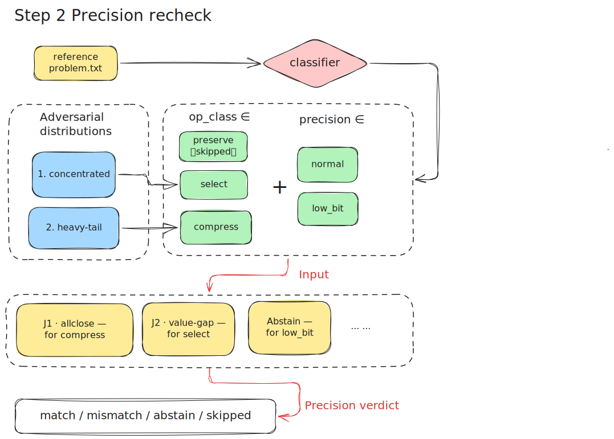

# Kernel Verification via Debate

A system that **decides whether to trust** a Triton kernel written by an LLM (a kernel is a
hand-written GPU routine; Triton is the language used to write it). First, it re-checks the kernel's correctness by writing several test code scripts with LLM to test the standard and robustness, then several LLM agents will act as different roles, starting the deabte argue about it. The goal is to catch kernels that "pass the test they shipped with" but are actually wrong, or were rigged to pass. We hope to simulate the human thinking and reasoning when we trying to figure out whether this kernel is correct or not. In this way, we attempt to prove its performance in real application.

---

## 1. Why this exists

Tools like meta's KernelAgent generate Triton kernels automatically, but they **write the
test and take it at the same time** — the same LLM writes the kernel, writes the test, and
often quietly switches the numbers from fp32 to the lower-precision bf16 (which makes the
"close enough" check looser) while testing only one input shape. The result is a kernel that
passes its own test but may still:

- **Read the wrong memory** when the input is not laid out back-to-back in memory (a
  "non-contiguous" tensor, e.g. the result of slicing with `[::2]`) because it never calls
  `.contiguous()`
- **Drop part of a large input** (a fixed `BLOCK_SIZE` that can't cover a long row)
- **Give numerically shaky answers** (e.g. a softmax that skips the usual max-subtraction
  trick, or sums things in an order that loses precision)
- **Cheat** (hard-code the one shape the test uses, pretend to use Triton while really calling
  PyTorch, or delay the computation to slip past the comparison)

This system is the **independent, skeptical reviewer**. It takes a kernel from any source
(KernelAgent is just the current generator and can be swapped out) and returns a trust
decision backed by evidence.

---

## 2. Overall Pipeline
The pipeline has one **offline** step in order to generate the test kernel (so called dataset) and two **online** steps
(run each time you verify a kernel):

- **Step 1 — Build the dataset (`kv-build`)**: run KernelAgent to turn a problem (we use KernelBench dataset) into a
  kernel and save it under `dataset/`. Run once and the saved data stays.
- **Step 2 — Re-check (`kv-run`)**: load a saved kernel and run our **own** correctness test —
  a `standard` case (core correctness) plus a **shape/layout battery** (non-contiguous, odd
  size, empty).
- **Step 2b — Precision recheck (`kv-run` / `kv-precision-recheck`)**: a **classifier** first
  decides the operator's class, then a **value-distribution battery** is fed through the
  judge that fits that class (allclose / value-gap / abstain). This catches kernels that are
  right on standard inputs but wrong on the operator's class-specific stress distribution — see
  [Step 2b](#step-2b--precision-recheck-operator-class-routed) and
  [precision_verification.md](precision_verification.md).
- **Step 3 — Debate (`kv-run`)**: several LLM agents argue about the kernel to find the bugs a
  fixed checklist can not anticipate. The debate is now **class-aware** (it receives the
  operator class) and the **judge is the final arbiter** over every signal.

> **Key design point**: the verification does **not** rely on the generator giving us a test.
> Hand it a generator that only produces `kernel.py` and Steps 2–3 still work — because the
> re-check writes its own test.

The whole online pipeline at a glance — re-check **and** precision check feed a class-aware
debate; the judge arbitrates a single final verdict (`trust / reject / needs_more_evidence /
needs_downstream`):


### Step 1 — Build the dataset


<sub>Source (editable): [docs/step1.drawio.pdf](docs/step1.drawio.pdf)</sub>

A **KernelBench problem** (a PyTorch reference made of three parts: a `Model`, a `get_inputs`
that supplies the runtime data, and a `get_init_inputs` that supplies the model's setup
arguments) is handed to `verifier/generator.py`, which drives `KernelAgent.TritonKernelAgent`
in three phases:

1. **The LLM writes a test** for the problem.
2. **The LLM writes N first-draft kernels** ("seeds") — N independent attempts.
3. **N workers refine the kernels in parallel**: each worker writes its kernel, runs the test
   in a separate process, feeds any errors back to the LLM, and tries again, up to
   `max_rounds`. If any worker's kernel passes, that's a success; if all fail, we still keep
   the closest attempt and its error.

The result is saved by `verifier/dataset.py : save_entry()` into one self-contained folder,
`dataset/<name>/`, holding:

| File | Contents |
|---|---|
| `problem.txt` | the original problem |
| `kernel.py` | the final kernel (the closest attempt, if none passed) |
| `test.py` | KernelAgent's own test (kept for reference only — **we don't rely on it**) |
| `seed_*.py` | the first-draft kernels |
| `meta.json` | `{ passed, status, rounds, ... }` |
| `error.txt` | the error output, if it failed |

Because everything is **copied in** (not just pointed to), the folder can be committed to
git, moved to another machine, or written by hand — deleting KernelAgent's working directory
will not break it.

### Step 2 — Re-check


<sub>Source (editable): [docs/step2.drawio.pdf](docs/step2.drawio.pdf)</sub>

This is where we **stop trusting the generator** (`verifier/recheck.py`). `kv-run` first
calls `get_recheck(entry)` (it reuses a saved result if there is one; `--force-recheck` re-runs
it):

1. **`generate_test()`** — the LLM reads `problem.txt` + `kernel.py` and writes a test.
   Because it can see the kernel's source, it knows how to call it (this sidesteps the problem
   that every kernel takes different arguments). The prompt makes it run a **fixed set of
   stress tests**:

   | Case | What it checks |
   |---|---|
   | `standard` | the problem's normal inputs → **core correctness** |
   | `noncontig_stride2` | a non-back-to-back input via `[::2]` / `[:, ::2]` |
   | `noncontig_transpose` | a transposed view (`.t()`) |
   | `odd_size` | a size that's off by one (not a round number) |
   | `zero-element tensor` (`empty`) | an empty input |

   Cases 2–5 are the **robustness** checks. Every case is decided by the one shared comparison
   function `compare_outputs()` and prints `CASE <name>: PASS/FAIL/SKIP`.

2. **`run_test()`** — a temporary folder gets `kernel.py` + `kverify_compare.py` (the shared
   comparison function) + the test; a **separate process** runs it. (Starting a fresh process
   avoids a known CUDA crash that happens when a process that already touched the GPU forks.)
   Inside, the same `inputs` go through both the **kernel** and **PyTorch**, and
   `compare_outputs()` decides each case. The process's exit code reflects **only** the
   `standard` case.

3. **Read the `CASE` lines** and split the result into two levels:
   - **`standard` FAIL → `status=failed` → a real bug.**
   - **a stress-test FAIL → noted under `robustness`, but NOT an automatic rejection** (those
     unusual inputs may be outside what the kernel was meant to handle).

The re-check result is then **merged into the saved record** — `passed`, `status`,
`test_code`, `error` — overwriting whatever the original generator claimed.

### Step 2b — Precision recheck (operator-class-routed)



The Step 2 battery above varies the input's **shape/layout**, but always on standard
`torch.randn` **values**. That misses a whole class of bugs where the *judging rule itself*
fails: `compare_outputs`' "small numerical error ⇒ correct" only holds for some operators.
Step 2b (`verifier/precision_recheck.py`, run on every `kv-run` or standalone via
`kv-precision-recheck`) closes that gap with **"先判算子哪类 → 选裁判 → 判不了就 abstain"**.
Full analysis: [precision_verification.md](precision_verification.md).

**1. Classify the operator** (`verifier/classify.py`). It runs only the *trusted reference*
(`problem.txt`'s PyTorch) on small CPU inputs — no kernel, no GPU — and labels it on two axes:

`op_class ∈ { preserve, compress, select }` — **what the math does to errors**:

| `op_class` | Examples | What makes it special | Can we trust numerical error? |
|---|---|---|---|
| **preserve** | matmul, add/mul, sum | magnitude-preserving; an error of size δ shows up as ~δ in the output | **Yes** — error is a faithful proxy |
| **compress** | softmax, ReLU/GELU/SiLU | squashes small/tail values toward 0, so tail errors are **invisible** on standard inputs | No — has blind regions |
| **select** | sort, top-k, argmax | output is a set of **indices**; `\|cand − ref\|` is undefined | No — there is no numerical distance |

`precision ∈ { normal, low_bit }` — **the number format of the output**:

| `precision` | Means | Consequence |
|---|---|---|
| **normal** | fp32 / bf16 / fp16 output | numerical comparison is usable |
| **low_bit** | fp8 / fp4 / int4 output | sub-resolution (tail) errors round to **exactly 0** — *no* tolerance or input can recover them |

**2. Feed a class-appropriate adversarial distribution** (the "送分" standard `randn` is exactly
what hides these bugs). There are **two** distributions, each aimed at one class's blind spot:

| Distribution | What it is | Targets | Exposes |
|---|---|---|---|
| **concentrated** | the true top-k "winners" all clustered in one region/block (think attention sinks / recent tokens) | **select** | per-block-quota / "winners are spread" assumptions that silently drop important keys |
| **heavy-tail** | one peak + a heavy band of comparable values just below it, so the tail carries real aggregate mass | **compress** | tail-truncation / cheap-tail-exp that assumes "the tail is negligible" |

**3. Route to the judge that fits the class** (`verifier/compare.py : judge()`):

| Judge | Used for | How it decides |
|---|---|---|
| **J1 · allclose** | compress | dtype-tiered numerical tolerance (`compare_outputs`), but on the adversarial distribution |
| **J2 · value-gap** | select | weights a dropped key by how much better it is than the worst kept key — **not** raw index recall (which punishes harmless tie-swaps) |
| **abstain** | low_bit | refuses to decide numerically and routes to a downstream / task-level check |
| *(skipped)* | preserve | no compression/selection blind spot — Step 2's shape/layout battery already covers it |

The result is a **`precision_recheck` verdict ∈ { match, mismatch, abstain, skipped }**, recorded
in `meta.json["precision_recheck"]`. A `mismatch` is an empirically-measured, class-specific
defect; `abstain` means the numbers genuinely cannot decide.

#### The red-team test set (`dataset/_advprec_*`)

To prove the precision axis actually works, the dataset carries hand-written `_advprec_*`
entries covering every cell of the `op_class × precision × {correct, buggy}` matrix — both
**positives** (a buggy kernel that must be caught) and **negatives** (a correct kernel that must
NOT be flagged). `tests/test_advprec_regression.py` drives them all through `precision_recheck`
and asserts each verdict.

| Kind | Entries | Verdict | What it checks |
|---|---|---|---|
| **catch** (select) | `topk_boundary`, `topk_subsample` | `mismatch` | a buggy top-k is caught — two different bug mechanisms |
| **catch** (compress) | `softmax_tail`, `softmax_countcap` | `mismatch` | a buggy softmax is caught — two different bug mechanisms |
| **control** | `topk_correct`, `softmax_correct` | `match` | a correct kernel is NOT false-alarmed |
| **control** (preserve) | `matmul_correct` | `skipped` | a preserve op is correctly skipped (no blind spot) |
| **abstain** (low-bit) | `softmax_fp8_tail`, `softmax_fp8_correct`, `matmul_fp8` | `abstain` | low-bit honestly abstains — for buggy AND correct kernels |
| **boundary** | `matmul_bug` | `skipped` | a preserve bug is left to the standard recheck, not the precision axis |
| **research target** | `magicpig_attn` | *(demo)* | a real sparse-attention method — exposes a verifier gap (below) |

Per entry:

- **`topk_boundary`** — an approximate top-k with a *per-block-quota* bug: recall ≈ 1.0 on
  `torch.randn` but collapses (recall 0.38, value-gap ~7) when the winners concentrate in one
  block. The distribution-dependent false accept. Caught by J2's value-gap.
- **`topk_subsample`** — a second select bug, *different mechanism*: top-k over a strided
  subsample, so winners off the stride are unreachable. Confirms the catch is not over-fit to
  one bug.
- **`softmax_tail`** — a softmax that *truncates the far tail*: error ~0 on `randn`, but on a
  heavy-tail distribution the dropped mass is real (max error ~0.04). The compression-driven
  false accept.
- **`softmax_countcap`** — a second compress bug, *different mechanism*: keeps only the 32
  largest exp terms and zeros the rest. Same lesson, different code.
- **`topk_correct` / `softmax_correct`** — correct kernels; precision_recheck must return
  `match` even on the adversarial distribution. False-alarm guards (the dataset needs negatives,
  not just positives).
- **`matmul_correct`** — a correct preserve op. Preserve has no compression/selection blind
  spot, so the precision battery returns `skipped` and defers to the standard recheck.
- **`matmul_bug`** — a genuinely wrong preserve op that still returns `skipped`: documents the
  boundary that the precision axis does **not** overreach into preserve (the standard recheck
  owns that).
- **`softmax_fp8_tail` / `softmax_fp8_correct`** — a buggy and a correct FP8 softmax. Both
  `abstain`: in low-bit the tail error rounds to exactly 0, so numerical comparison can't decide
  — and that is true regardless of whether the kernel is right. Abstain is **format-driven**.
- **`matmul_fp8`** — a correct FP8 matmul; `abstain` too, showing the low-bit rule applies across
  op-classes, not just compress.
- **`magicpig_attn`** — a MagicPIG-style ([arXiv 2410.16179](https://arxiv.org/abs/2410.16179))
  LSH-sampling sparse attention: hash the keys into buckets, attend only to the query's bucket,
  softmax over that subset (the §4 *select + compress* stacked target). Judged on the downstream
  output `o` (`tests/advprec_magicpig_demo.py`): on concentrated scores `o` matches dense
  (~0.000), on uniform scores it is off by ~0.19 — the paper's stated failure mode. **It exposes
  a real gap**: `classify` labels attention `preserve` (the gain probe on a flat softmax sees a
  magnitude-preserving average), so `precision_recheck` *skips* it and would miss the bug. Marked
  `demo_only`; catching this class needs composite-op classification + multi-input adversarial
  inputs + downstream-output judging (see [precision_verification.md](precision_verification.md)
  §7 #8).

### Step 3 — Multi-agent debate


The debate (`verifier/debate.py` + `agents/`) handles the **logic bugs that a fixed checklist
can not list out in advance** (e.g. accumulation errors that only show up across blocks,
cheating, subtle precision issues). It is **class-aware**: it receives the `op_class` /
`precision` from Step 2b's classifier, so the skeptic attacks the right blind spot (tail for
compress, concentrated/tied distributions for select) and the judge applies class-appropriate
severity. **Each round** runs three agents in order:

- **Author** — *the describer*: explains what the kernel does and how it changed from its
  first drafts (`seed_*.py`). Describe only, **no opinions**.
- **Skeptic** — *the challenger*: looks for possible bugs and files each one as a **specific,
  testable claim** (e.g. `{"type":"non_contiguous_bug","statement":"for x[::2] the kernel
  reads the wrong memory"}`). Each claim goes onto a running **list of claims**, marked
  `not verified` (open).
- **Verifier** — *the tester*: for each open claim, writes a **small test script**, runs it on
  the GPU against both the kernel and PyTorch, uses `compare_outputs` to judge, and marks the
  claim **confirmed / rebutted / inconclusive** (saving the script and the measured numbers as
  evidence).

**When to stop**: if the skeptic raises **new claims**, the loop runs again; when it has **no
new claim**, the rounds stop.

**The precision finding enters here too** (`design B`): Step 2b's `precision_recheck` verdict
is pre-filed into the claims ledger as an already-resolved claim (`confirmed` on a `mismatch`,
`inconclusive` on an `abstain`), so the judge weighs that empirical evidence instead of
re-discovering it.

Then the **Judge** — *the final arbiter* — reads the whole ledger **plus** the standard-recheck
status and robustness summary, and gives the verdict: **`trust` / `reject` /
`needs_more_evidence` / `needs_downstream`**, plus which claims were decisive. It makes the call
that counting can't (is a confirmed difference expected bf16 rounding or a real bug?), can
**overrule** the verifier, and is the final say on the precision finding too. A thin
deterministic floor (`verifier/verdict.py`) only enforces one fact: a kernel wrong on the
problem's *normal* inputs can never be `trust`.

The full record is written to `dataset/<entry>/debate_result.json`:
`{ recheck_status, precision_recheck, verdict, final, claims (the full list), history }`.

---

## 3. Component deep dive

### 3.1 `verifier/generator.py` — drives KernelAgent

Turns `KernelAgent.TritonKernelAgent.generate_kernel()` into one consistent record:
`{kernel_code, test_code, passed, status, rounds, error, session_dir, raw}`.

On success `kernel_code` is the final kernel; on failure it is the closest attempt (from
whichever worker got furthest) plus the error. (We patched KernelAgent for this — it
originally returned nothing on failure; see [roadmap.md](roadmap.md).)

### 3.2 `verifier/dataset.py` — a self-contained dataset

`save_entry()` **copies** each run's files into `dataset/<name>/` (instead of saving a path),
so deleting KernelAgent's working directory doesn't break the dataset — it can be committed,
moved between machines, or written by hand for testing. `load_entry()` reads it back into a
record; `session_dir` points at the folder itself, which is where the Author later reads
`seed_*.py` from.

### 3.3 `verifier/recheck.py` — our own correctness check (the answer we trust)

`get_recheck()` runs `generate_test()` → `run_test()` → read the `CASE` lines, saving two
levels in `meta.json["recheck"]`: `status` (from the `standard` case only — this is what
decides "is it a real bug") and `robustness` (the stress-test cases, noted only).

**Why a fixed set of stress tests**: previously only the debate's skeptic poked at unusual
inputs, and only when it happened to think of them — so the same non-contiguous bug would be
caught one run and missed the next. The fixed set runs the same checks every time, so the
mechanical bugs (non-contiguous / odd size / empty) are never missed.

**What the two levels mean (deciding what's in scope)**: a kernel that fails on the problem's
normal inputs is clearly broken (reject); one that only fails on unusual inputs like
non-contiguous has a robustness gap — noted but not condemned, because those inputs may be
outside what the kernel was meant to handle.

### 3.4 `verifier/compare.py` — the one place that decides "is it correct"

`compare_outputs(out, ref) → (matches, max_diff, detail)`. Both the re-check test and the
verifier's test scripts **import it** (it's copied into the temporary folder as
`kverify_compare.py` at run time), so the "is it correct" decision lives in exactly one place
and is fixed:

- **The allowed error margin depends on the number format**: fp32 uses 1e-3, fp16/bf16 use
  1e-2/2e-2 (the LLM is not allowed to make up its own number like `1e-4`)
- **`equal_nan=True`**: if the kernel and the reference both produce NaN at the same spot,
  that counts as a match (a softmax of all-`-inf` gives NaN in PyTorch too — not the kernel's
  fault)
- **A bug means "differs from the reference"**, never "produced a NaN or a big number" on its
  own

> This file was added after a bug: early on, the LLM wrote the comparison inside each test
> script, picked error margins arbitrarily, and mishandled NaN, causing false alarms.
> Pulling the comparison into one fixed function made the re-check and the verifier use the
> same standard.

### 3.5 `verifier/debate.py` + `agents/` — the multi-agent debate

Four roles:

- **`agents/author.py` (the describer)**: reads the final kernel + `seed_*.py` and plainly
  describes what the kernel does and what changed from first draft to final. The prompt bans
  opinions — describe only. Says `NO_NEW_OBSERVATIONS.` when there's nothing to add.
- **`agents/skeptic.py` (the challenger)**: hunts for possible bugs or cheating, but must
  write each one as a **specific, testable claim** (with the exact input to test). Says
  `NO_NEW_CONCERNS.` + an empty list when out of new concerns.
- **`agents/verifier.py` (the tester)**: goes through the open claims, **writes one test
  script per claim** that builds the input, runs the kernel and the reference, judges with
  `compare_outputs`, and writes the result back onto the claim (confirmed / rebutted /
  inconclusive) along with the evidence (the script + the measured numbers).
- **`agents/judge.py` (the final decision-maker)**: doesn't speak each round — it **reads the
  whole list of claims once at the end** and gives the verdict. It makes the severity call
  that counting can't: is a confirmed difference of 256 a real bug or expected bf16 rounding?
  The judge can **overrule** the verifier. Outputs
  `{verdict, confidence, decisive_claims, claim_notes, reason}`.

- **`agents/parsing.py`**: reliably pulls the JSON out of an LLM reply (prefers the ```json
  block, ignores ```python code blocks that show up in the prose).
- **`agents/types.py`**: the `Turn` / `Claim` type definitions.

**When to stop**: each round runs author → skeptic → verifier; it stops when the skeptic
raises no new claim. The judge isn't part of the rounds; it decides once after the loop ends.

### 3.6 `verifier/llm_client.py` — the LLM calls

A single wrapper around Anthropic's API. Two notes: (1) the API keeps no memory between calls,
so we hold the message list ourselves; (2) the messages are arranged so the prompt cache can
be reused across rounds for the same agent (the kernel and test go in the part of the prompt
that gets cached). `oneshot()` is the one-off call (no conversation history) that the re-check
and verifier use to write their test scripts.

### 3.7 `verifier/gpu_pick.py` — picking a free GPU automatically

Before running, it ranks GPUs using `nvidia-smi` and then actually tries a small allocation as
a test (a card can look "free" in `nvidia-smi` but still refuse to run on a shared machine),
then points `CUDA_VISIBLE_DEVICES` at the first one that works.

---

## 4. The signals and the final verdict

`kv-run` produces four separate signals, then combines them into one answer:

| Signal | Comes from | Means | Values |
|---|---|---|---|
| `recheck.status` | the `standard` case | **Core correctness**: right on the problem's normal inputs? | `passed` / `failed` |
| `recheck.robustness` | the shape/layout battery | **Robustness**: handles non-contiguous / odd size / empty? | per-case `pass/fail/skip` |
| `precision_recheck.verdict` | classifier + class-routed judge on the adversarial distribution | **Precision review**: right on the operator's class-specific stress distribution? | `match` / `mismatch` / `abstain` / `skipped` |
| `debate.verdict` | author/skeptic/verifier/judge | **Logic review**: bugs or cheating a fixed checklist can't anticipate | `trust` / `reject` / `needs_more_evidence` / `needs_downstream` |

These no longer float separately. The **judge is the final arbiter** — it sees the recheck
status, robustness, and the precision finding (pre-filed into its ledger), and issues the
verdict. `verifier/verdict.py` then applies one deterministic **floor** on top: a kernel that
failed the `standard` case can never be `trust`. The combined answer is the `final` field:

| `final` | Meaning |
|---|---|
| `trust` | no real defect stands |
| `reject` | a genuine defect (standard failure, a confirmed precision/logic bug) |
| `needs_more_evidence` | real concerns remain only untested |
| `needs_downstream` | numerical comparison structurally can't decide (low-bit) — route to a task-level check |

---

## 5. Repository layout

```
kernel_verification/
├── KernelAgent/        # the generator we build on (meta-pytorch/KernelAgent), patched, copied in
├── KernelBench/        # the problem set (ScalingIntelligence/KernelBench), copied in
├── verifier/           # main package
│   ├── generator.py    # drives KernelAgent
│   ├── dataset.py      # save_entry / load_entry / iter_entries
│   ├── recheck.py      # our own re-check + the shape/layout battery (kv-recheck)
│   ├── classify.py     # operator-class router: op_class + precision (Step 2b)
│   ├── precision_recheck.py # class-routed judge on adversarial distributions (kv-precision-recheck)
│   ├── compare.py      # compare_outputs (J1) + judge() router (J1/J2/abstain)
│   ├── verdict.py      # the thin standard-correctness floor over the judge
│   ├── debate.py       # the debate loop run_debate (class-aware, seeds precision claim)
│   ├── llm_client.py   # Anthropic calls + prompt cache
│   ├── gpu_pick.py     # auto-pick a usable GPU
│   ├── build_dataset.py# build the dataset offline (kv-build)
│   └── run.py          # run the online verification (kv-run)
├── agents/             # the four roles + helpers (skeptic/judge are class-aware)
│   ├── author.py  skeptic.py  verifier.py  judge.py
│   ├── parsing.py      # pull JSON out of replies
│   └── types.py        # Turn / Claim
├── dataset/            # generated kernels + their results (can be committed)
│   ├── <name>/{problem.txt, kernel.py, test.py, seed_*.py,
│   │           meta.json, recheck_test.py, debate_result.json, ...}
│   └── _advprec_*/     # hand-written red-team entries (precision-axis yardsticks)
├── docs/               # diagrams (.svg shown in README)
│   ├── kvoverall.drawio.svg   # the whole online pipeline (current)
│   ├── step1.drawio.svg       # build the dataset
│   ├── step2.drawio.svg       # re-check (shape/layout battery)
│   ├── step2b_precision.svg   # precision recheck (classify + class-routed judge)
│   └── kv3.drawio.svg         # multi-agent debate (class-aware)
├── tests/              # demos (advprec_*_demo.py) + assert regression (test_advprec_regression.py)
├── precision_verification.md  # the precision-judgment axis: design + 4-class analysis + limits
├── pyproject.toml      # uv project, torch cu128, KernelAgent path dependency
└── roadmap.md          # notes on how the design evolved
```

---

## 6. CLI reference

```bash
# Step 1 — build the dataset (expensive/slow/needs GPU, run once)
uv run kv-build --curated              # build 10 hand-picked KernelBench problems
uv run kv-build --problem elem_add     # build one built-in problem
uv run kv-build --curated --list       # preview only: show what would be built

# Step 2 only — our own re-check (no debate)
uv run kv-recheck                       # run everything not yet re-checked
uv run kv-recheck elem_add              # re-run one (forced)
uv run kv-recheck --list                # show each entry's re-check result

# Step 2b only — precision recheck (classify + class-routed judge, no debate)
uv run kv-precision-recheck             # run all: classify + adversarial-distribution judge
uv run kv-precision-recheck _advprec_topk_boundary   # one entry
uv run kv-precision-recheck --list      # show each entry's op_class / precision / verdict

# Steps 2 + 2b + 3 — full verification (re-check → precision → debate → final verdict)
uv run kv-run elem_add                  # run one
uv run kv-run elem_add --verbose        # watch everything: the re-check test, each agent turn, each test script
uv run kv-run elem_add --force-recheck  # redo the re-check test first, then run
uv run kv-run --list                    # list the entries you can run
```

After a run, see `dataset/<entry>/debate_result.json` for the full record.

---

## 7. Known limitations

- **Parallelism in Multi-agents** currently the debate stage, all agents works in sequence, and this cannot be easily arranged in parallel. Since the skeptic needs the description from author and the verifier needs the claim from skeptic to verify. This is natuarrly in sequence pipeline which makes the parallelism hard to realize.

- **Lack good evaluation** Currently still thinking how to evaluate the performance and effectiveness of our pipeline

- **The debate verdict still varies between runs**: the fixed stress tests made the
  mechanical bugs (non-contiguous, etc.) repeatable, but inside the debate the skeptic still
  comes up with claims randomly, so coverage of logic bugs still changes from run to run.
  
- **The stress-test cases are still written by the LLM**: the checklist is fixed, but how each
  case is actually built is still generated by the LLM, so there's some variation. Removing it
  entirely would need a pure-Python harness — which runs into the "how do you call any kernel
  generically" problem.
  
- **The three results aren't combined**: `recheck.status` / `robustness` / `debate.verdict`
  are produced separately; how to turn them into one final answer is undecided.
