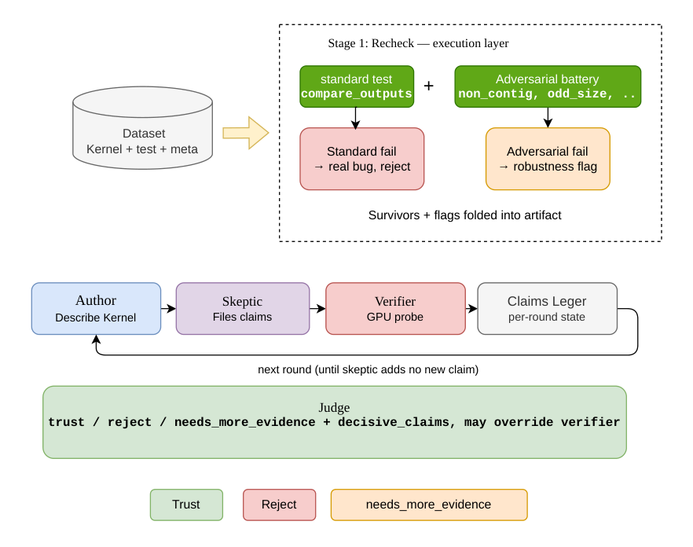
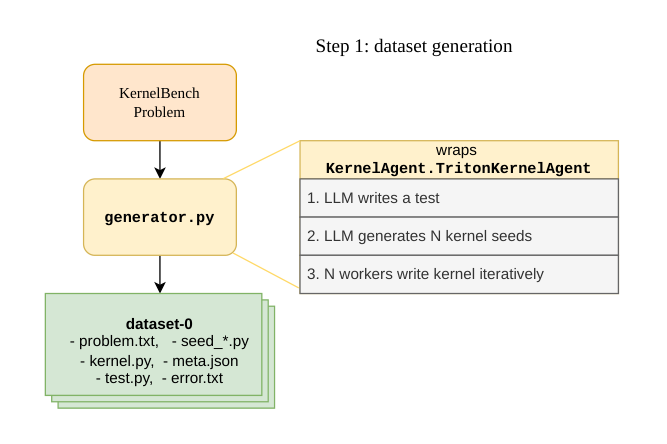
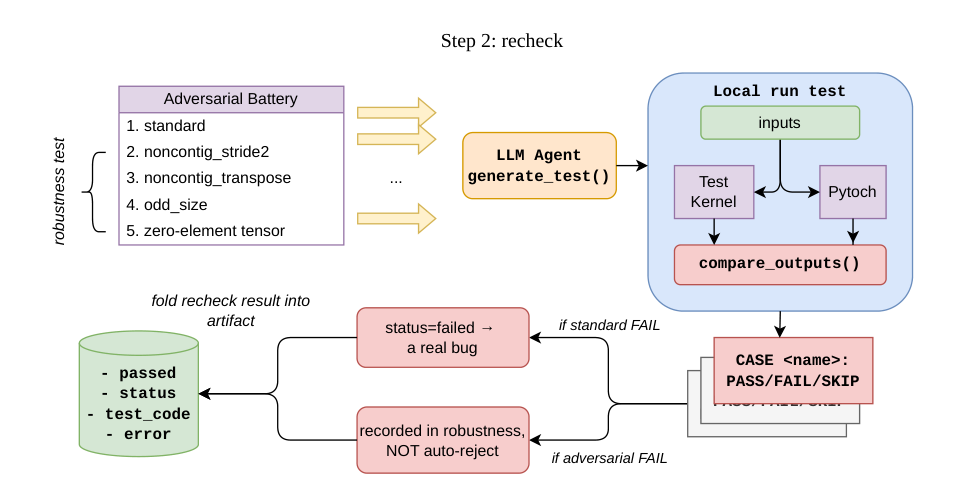
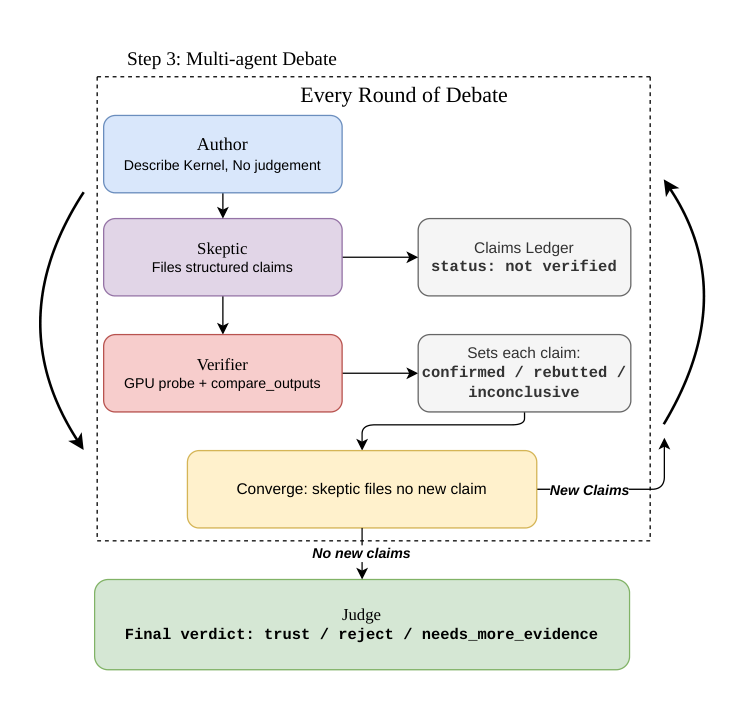

# Kernel Verification via Debate

A system that **judges the trustworthiness** of LLM-generated Triton kernels. It does
not trust the generator's own test; instead it independently re-checks correctness and
runs a multi-agent debate, with a focus on catching kernels that "pass their own test
but are actually wrong or gamed."

---

## 1. Why this exists

Tools like meta's KernelAgent auto-generate Triton kernels, but they **set the exam and
sit it at the same time** — the same LLM writes the kernel, writes the test, and often
silently downcasts fp32 to bf16 to loosen tolerance and tests only a single shape. The
result is a kernel that "passes its own test" but may still:

- **Read the wrong memory on non-contiguous inputs** (no `.contiguous()` call)
- **Truncate large inputs** (hard-coded `BLOCK_SIZE`, drops data when a row is too long)
- **Be numerically unstable** (softmax without max-subtraction, drifting reduction order)
- **Cheat** (hard-code the test's shape, fake Triton while calling torch, lazy-eval to fool `allclose`)

This system is the **distrustful, independent reviewer**. It accepts a kernel from any
source (KernelAgent is just the current generator, and is replaceable) and outputs an
evidence-backed trust judgment.

---

## 2. How it works: three steps

The pipeline splits into one **offline** step and two **online** steps:

- **Step 1 — Dataset generation (`kv-build`)**: run KernelAgent to turn a problem into a
  kernel and store it in `dataset/`. Expensive, slow, needs a GPU. Run once; the data
  persists.
- **Step 2 — Recheck (`kv-run`, first half)**: read a kernel back from `dataset/` and run
  our own independent correctness test against it.
- **Step 3 — Debate (`kv-run`, second half)**: run a multi-agent debate that hunts for the
  semantic bugs a fixed test cannot enumerate, ending in a verdict.

Steps 2–3 are cheap, so you can iterate on agent prompts without regenerating kernels.

> **Key design point**: verification does **not** depend on the generator providing a test.
> Swap in a generator that emits only `kernel.py` and Steps 2–3 still work — because
> recheck writes its own test.

The online half (Steps 2–3) at a glance — a recheck execution layer feeding a debate that
ends in a verdict:



<sub>Source (editable): [docs/overview.drawio.pdf](docs/overview.drawio.pdf)</sub>

### Step 1 — Dataset generation



<sub>Source (editable): [docs/step1.drawio.pdf](docs/step1.drawio.pdf)</sub>

A **KernelBench problem** (a PyTorch reference: `Model` + `get_inputs` + `get_init_inputs`)
is fed to `verifier/generator.py`, which wraps `KernelAgent.TritonKernelAgent` and runs it
in three phases:

1. **LLM writes a test** for the problem.
2. **LLM generates N kernel seeds** — N independent first-draft kernels.
3. **N workers write the kernel iteratively** in parallel: each worker writes its kernel,
   subprocess-runs the test, feeds errors back to the LLM, and retries up to `max_rounds`.
   Any worker passing counts as success; on failure we also recover the "best attempt" and
   its error.

The result is saved by `verifier/dataset.py : save_entry()` into a self-contained directory
`dataset/<name>/` holding:

| File | Contents |
|---|---|
| `problem.txt` | the original problem |
| `kernel.py` | the final kernel (best attempt if it failed) |
| `test.py` | KernelAgent's own test (reference only, **not trusted**) |
| `seed_*.py` | the initial seeds |
| `meta.json` | `{ passed, status, rounds, ... }` |
| `error.txt` | stderr/stdout on failure |

Because everything is **copied** (not referenced by path), the entry can be committed, moved
between machines, or hand-authored — deleting KernelAgent's run directory does not break it.

### Step 2 — Recheck



<sub>Source (editable): [docs/step2.drawio.pdf](docs/step2.drawio.pdf)</sub>

This is the heart of **distrusting the generator** (`verifier/recheck.py`). `kv-run` first
calls `get_recheck(entry)` (reuses a cached result; `--force-recheck` to redo it):

1. **`generate_test()`** — the LLM reads `problem.txt` + `kernel.py` and writes a test.
   Because it sees the kernel source, it knows how to call it (sidestepping the "every kernel
   has a different signature" problem). The prompt forces a **fixed adversarial battery**:

   | Case | What it stresses |
   |---|---|
   | `standard` | the spec's inputs → **core correctness** |
   | `noncontig_stride2` | non-contiguous `[::2]` / `[:, ::2]` |
   | `noncontig_transpose` | a transposed `.t()` view |
   | `odd_size` | size ±1, non-aligned |
   | `zero-element tensor` (`empty`) | a zero-element input |

   Cases 2–5 are the **robustness** tier. Each case is judged by the fixed
   `compare_outputs()` and prints `CASE <name>: PASS/FAIL/SKIP`.

2. **`run_test()`** — a temp dir holds `kernel.py` + `kverify_compare.py` (the fixed
   comparator) + the test; a **subprocess** runs it (a fresh process avoids the CUDA fork
   trap). Inside, the same `inputs` flow through both the **test kernel** and **PyTorch**,
   and `compare_outputs()` decides each case. The exit code reflects **only** the `standard`
   case.

3. **Parse the `CASE` lines** into two tiers:
   - **`standard` FAIL → `status=failed` → a real bug.**
   - **adversarial FAIL → recorded in `robustness`, NOT auto-reject** (such inputs may be
     outside the kernel's intended scope).

The recheck result is then **folded into the artifact** — `passed`, `status`, `test_code`,
`error` — replacing whatever the upstream generator claimed.

### Step 3 — Multi-agent debate



<sub>Source (editable): [docs/step3.drawio.pdf](docs/step3.drawio.pdf)</sub>

Debate (`verifier/debate.py` + `agents/`) handles the **semantic / algorithmic bugs the
battery cannot enumerate** (cross-block accumulation errors, cheating, subtle numerics).
**Every round of debate** runs three roles in sequence:

- **Author** — *witness*: describes what the kernel does and how it evolved from
  `seed_*.py`. Describe only, **no judgment**.
- **Skeptic** — *challenger*: files **structured claims** (concrete, testable assertions,
  e.g. `{"type":"non_contiguous_bug","statement":"for x[::2] the kernel misreads"}`). Each
  is registered into the **claims ledger** with `status: not verified` (open).
- **Verifier** — *executor*: for each open claim, writes a **GPU probe**, runs kernel +
  reference, judges via `compare_outputs`, and sets the claim to **confirmed / rebutted /
  inconclusive** (with the probe code + measured numbers as evidence).

**Convergence**: if the skeptic files **new claims**, the loop repeats; when it files **no
new claim**, the round loop stops.

Then the **Judge** — *arbiter* — reads the whole ledger **once** and renders the final
verdict: **trust / reject / needs_more_evidence**, plus the decisive claims. The judge makes
the severity call counting cannot (is a confirmed diff expected bf16 rounding or a real
bug?) and may **override** the verifier.

The full record is written to `dataset/<entry>/debate_result.json`:
`{ recheck_status, verdict, claims (the ledger), history (all turns) }`.

---

## 3. Component deep dive

### 3.1 `verifier/generator.py` — wraps KernelAgent

Normalizes `KernelAgent.TritonKernelAgent.generate_kernel()` into a uniform artifact:
`{kernel_code, test_code, passed, status, rounds, error, session_dir, raw}`.

On success `kernel_code` is the final kernel; on failure it is the "best attempt from the
worker that fought the longest" plus error info (upstream KernelAgent is patched — it
originally left nothing on failure, see [roadmap.md](roadmap.md)).

### 3.2 `verifier/dataset.py` — self-contained dataset

`save_entry()` **copies** each generation's artifacts into `dataset/<name>/` (rather than
recording a path), so deleting KernelAgent's run directory does not break the dataset — it
can be committed, moved between machines, or hand-authored for injection. `load_entry()`
reads it back into an artifact; `session_dir` points at the entry dir itself, which is where
the author reads `seed_*.py` from.

### 3.3 `verifier/recheck.py` — independent correctness re-check (our ground truth)

`get_recheck()` runs `generate_test()` → `run_test()` → parse `CASE` lines, storing two
tiers in `meta.json["recheck"]`: `status` (from `standard` only, drives "is it a real bug")
and `robustness` (the adversarial cases, recorded only).

**Why the battery**: previously only the debate skeptic probed adversarial inputs ad hoc,
which is non-deterministic — the same kernel with a non-contiguous bug would be caught one
run (skeptic thought of it) and missed the next (it didn't). The battery hard-codes the list
and runs it every time, so mechanical bugs (non-contiguous / odd size / empty) are no longer
missed.

**What the two tiers mean (the scope contract)**: a kernel that fails on the spec's normal
inputs is an unambiguous bug (reject); one that only fails on adversarial inputs like
non-contiguous is a robustness gap — recorded but not condemned, because such inputs may be
outside the kernel's intended scope.

### 3.4 `verifier/compare.py` — the single source of truth for comparison

`compare_outputs(out, ref) → (matches, max_diff, detail)`. Both the recheck test and the
verifier probe **import it** (copied into the temp dir as `kverify_compare.py` at run time),
so the "is it correct" decision lives in exactly one place and is fixed:

- **Tolerance by dtype**: fp32 uses 1e-3, fp16/bf16 uses 1e-2/2e-2 (the LLM is not allowed to
  invent its own threshold like `1e-4`)
- **`equal_nan=True`**: kernel and reference both NaN at the same position counts as a match
  (softmax of all-inf yields NaN in PyTorch too — that is not the kernel's fault)
- **A bug means "diverges from the reference"**, never "produced a NaN/large value" in isolation

> This file was added after a bug: early on the LLM wrote the comparison inside each probe,
> picked tolerances arbitrarily, and mishandled NaN, producing false positives. Extracting a
> fixed comparator made recheck and verifier use the same yardstick.

### 3.5 `verifier/debate.py` + `agents/` — multi-agent debate

Four roles:

- **`agents/author.py` (witness)**: reads the final kernel + `seed_*.py` and objectively
  describes what the kernel does and what changed from seed to final. The prompt forbids
  quality judgment — describe only. Emits `NO_NEW_OBSERVATIONS.` when it has nothing to add.
- **`agents/skeptic.py` (challenger)**: looks for possible bugs/cheating, but must file them
  as **structured claims** — a concrete assertion verifiable by running code (with the exact
  input to test). Emits `NO_NEW_CONCERNS.` + an empty claim list when out of new concerns.
- **`agents/verifier.py` (executor)**: walks the `open` claims in the ledger, **writes a probe
  per claim** that constructs the input, runs kernel + reference, judges via `compare_outputs`,
  and writes the result back to the claim (confirmed / rebutted / inconclusive) plus evidence
  (probe code + measured numbers).
- **`agents/judge.py` (arbiter)**: does not speak per round — it **reads the whole ledger once
  at the end** and renders the verdict. It makes the severity call counting cannot: is a
  confirmed diff of 256 a real bug or expected bf16 rounding? The judge may **override** the
  verifier's call. Outputs `{verdict, confidence, decisive_claims, claim_notes, reason}`.

- **`agents/parsing.py`**: robustly extracts JSON from an LLM reply (prefers the ```json block,
  skips ```python code blocks that appear in prose).
- **`agents/types.py`**: the `Turn` / `Claim` TypedDict definitions.

**Convergence**: each round runs author → skeptic → verifier; it stops when the skeptic files
no new claim. The judge is not part of the rounds; it adjudicates once after the loop.

### 3.6 `verifier/llm_client.py` — LLM calls

A single Anthropic wrapper. Two points: (1) the API is stateless, so we own the message list;
(2) the message layout lets the prompt cache hit across rounds for the same agent (kernel/test
go in the cacheable prefix). `oneshot()` is the historyless call used by recheck/verifier to
write probes.

### 3.7 `verifier/gpu_pick.py` — automatic GPU selection

Before running, sort GPUs via `nvidia-smi` and then actually attempt a small allocation as a
probe (a card can report "free" in nvidia-smi yet refuse a context on a shared machine), then
set `CUDA_VISIBLE_DEVICES` to the first usable one.

---

## 4. The three signals

After `kv-run` finishes a kernel, you get three layers of judgment — **do not conflate them**:

| Signal | Source | Meaning |
|---|---|---|
| `recheck.status` | the battery's `standard` case | **Core correctness**: right on the spec's normal inputs? |
| `recheck.robustness` | the battery's adversarial cases | **Robustness**: handles non-contiguous / odd size / empty? |
| `debate.verdict` | author/skeptic/verifier/judge | **Semantic review**: algorithmic bugs / cheating the battery can't enumerate |

> Note: these three signals are currently produced separately; how to combine them into one
> final conclusion is still an open design point.

---

## 5. Repository layout

```
kernel_verification/
├── KernelAgent/        # upstream generator (meta-pytorch/KernelAgent), patched, vendored
├── KernelBench/        # problem set (ScalingIntelligence/KernelBench), vendored
├── verifier/           # main package
│   ├── generator.py    # wraps KernelAgent
│   ├── dataset.py      # save_entry / load_entry / iter_entries
│   ├── recheck.py      # independent re-check + adversarial battery (kv-recheck)
│   ├── compare.py      # fixed comparator compare_outputs (single source of truth)
│   ├── debate.py       # debate main loop run_debate
│   ├── llm_client.py   # Anthropic calls + prompt cache
│   ├── gpu_pick.py     # auto-pick a usable GPU
│   ├── build_dataset.py# offline dataset build (kv-build)
│   └── run.py          # online verification entry (kv-run)
├── agents/             # the four roles + helpers
│   ├── author.py  skeptic.py  verifier.py  judge.py
│   ├── parsing.py      # JSON extraction
│   └── types.py        # Turn / Claim
├── dataset/            # generated kernels + three labels (committable)
│   └── <name>/{problem.txt, kernel.py, test.py, seed_*.py,
│               meta.json, recheck_test.py, debate_result.json, ...}
├── docs/               # diagrams (.png rendered in README, .drawio.pdf = editable source)
│   ├── overview.{png,drawio.pdf}  # online verification at a glance
│   ├── step1.{png,drawio.pdf}     # dataset generation
│   ├── step2.{png,drawio.pdf}     # recheck
│   └── step3.{png,drawio.pdf}     # multi-agent debate
├── tests/              # exploration / debugging scripts
├── pyproject.toml      # uv project, torch cu128, KernelAgent path dep
└── roadmap.md          # design evolution notes
```

---

## 6. CLI reference

```bash
# Step 1 — build the dataset (expensive/slow/needs GPU, run once)
uv run kv-build --curated              # build 10 curated KernelBench problems
uv run kv-build --problem elem_add     # build a single built-in problem
uv run kv-build --curated --list       # dry run, just show what would be built

# Step 2 only — independent re-check (no debate)
uv run kv-recheck                       # run everything not yet rechecked
uv run kv-recheck elem_add              # force re-run one
uv run kv-recheck --list                # show each entry's recheck status

# Steps 2 + 3 — verify (recheck → debate → verdict)
uv run kv-run elem_add                  # run one
uv run kv-run elem_add --verbose        # watch it all: recheck test / each agent turn / probe code
uv run kv-run elem_add --force-recheck  # regenerate the recheck test, then run
uv run kv-run --list                    # list runnable entries
```

After a run, see `dataset/<entry>/debate_result.json` for the full record.

---

## 7. Known limitations

- **The debate verdict is still non-deterministic**: the battery made mechanical bugs
  (non-contiguous, etc.) deterministic, but inside the debate the skeptic still files claims
  ad hoc, so coverage of semantic bugs still varies run-to-run.
- **Battery cases are still LLM-written**: the checklist is fixed, but each case's concrete
  construction is still generated by the LLM, so there is construction variance. Eliminating
  it fully requires a pure-Python harness (which hits the "call any kernel generically"
  signature problem).
- **The three signals are not combined**: `recheck.status` / `robustness` / `debate.verdict`
  are produced separately; how to synthesize a final conclusion is undecided.
- **The scope contract is not fixed**: whether inputs like non-contiguous "count as a bug"
  depends on the kernel's intended use; the current compromise is "fail on normal inputs =
  condemned, fail on adversarial inputs = recorded only."
