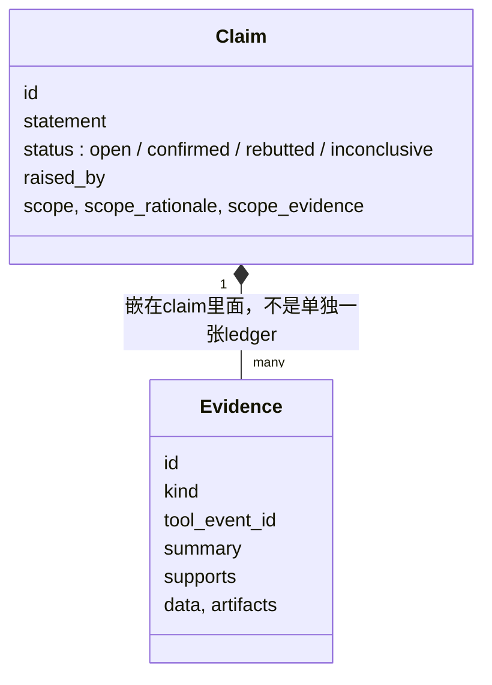

# 演讲稿(约10分钟)

【开场】

大家好,今天讲的项目叫"Kernel Verification via Multi-Agent Debate"——用多智能体辩论的方式,判断一个LLM写的Triton kernel到底能不能信。

背景很简单:现在用KernelAgent这类工具自动生成kernel,生成的同时也生成了测试,但往往是同一个LLM既写kernel又写test,只测一两个简单输入,单一个allclose测试通不通过并不能说明kernel是对的。所以我们需要一个独立于生成过程的审查系统。

【第一部分:Overall Pipeline】

整体流程分两步。第一步是离线的:用KernelAgent把一个KernelBench问题变成Triton kernel尝试加测试,存成一个自包含的dataset entry,里面有problem.txt、kernel.py、test.py、meta.json。第二步是在线的agentic verification:四个角色的agent——Describer不是简单复述kernel在干什么,它建立的description model里包含契约(contract_model)、kernel实现细节、风险点(risk_map),尤其是**scope_notes**,这个字段直接划定了这次验证的适用范围:哪些行为在benchmark契约之内、kernel要为此负责,哪些超出了契约范围、不算kernel的错。后面Skeptic提的每一条claim是in_scope还是out_of_scope,判断依据就是Describer定下的这个边界——所以Describer实际上决定的是"我们这套系统这次要不要为某个问题负责",而不只是写一段描述。

举个具体例子:有一个elem_add的kernel,内部写了处理"非整数倍block size"这种边界情况的masking逻辑。但这个benchmark的test.py把输入大小写死成1024,正好等于block size,从头到尾都不会触发这段masking代码。所以哪怕Skeptic怀疑这段masking逻辑本身可能有bug,这个怀疑也会被标成out_of_scope——不是说这段代码一定没问题,而是这次benchmark的契约根本没要求测它,系统不会为一个用不到的场景去扣分。反过来,只要benchmark实际会跑到的输入范围内,只要kernel有问题,就是in_scope,必须被抓出来。

Skeptic提出具体的、可测试的怀疑;Experimenter是唯一能跑代码的角色,设计并执行probe;Judge最后综合所有证据下判决:trust、reject,或者证据不够时的needs_more_evidence。核心原则是"evidence-driven,不是checklist-driven"——没有证据支持的结论不算数。

【第二部分:Orchestrator怎么运作】

四个agent之间从来不直接对话,所有交互都要经过Orchestrator。具体循环是:agent发起一个tool_call请求 → Orchestrator去真正执行这个工具 → 工具返回原始结果给Orchestrator → Orchestrator把结果写进共享状态RunState → 再把输出返还给发起请求的agent。这个共享状态里存着claim ledger、description model、完整的run log、以及convergence/skeptic review这些收敛控制信息。

claim ledger这块要单独强调一下——每条claim自带嵌入的evidence,不是单独一张表:

之前的老图把evidence画成了跟claim并列的独立ledger,那是错的——真实代码里,claim要从open变成confirmed/rebutted/inconclusive,必须自带一条`supports`字段匹配的evidence,评委看的是claim这一个对象,不用去另一张表关联查找。权限也是代码层面强制的:比如只有Experimenter能跑probe,只有Judge能下verdict,不是靠prompt里嘱咐几句就完事。

【第三部分:一个完整例子】

举个真实案例——cumsum这个kernel。Skeptic提出怀疑后,Experimenter先测了4个小规模假设,全部被推翻,看起来没问题。但它没有就此打住,而是按benchmark要求的真实规模32768×32768又测了一次,这时候炸出92.8%的元素超差,最大误差12416——这个数字和这个kernel当年被KernelAgent放弃时记录的误差**完全一致**,证明我们的系统是真的独立测出了问题,不是巧合。这类"小规模测不出、必须上真实规模才暴露"的bug,恰恰是最容易被普通测试漏掉的。

【第四部分:Skills、Tools与Protocol】

Skills是8份写给agent看的markdown指导文档,比如claim-lifecycle、adversarial-precision、scope-policy,它们不是代码,是"怎么想问题"的指导。Tools是18个真正能执行的动作,权限按角色划分,注册在代码里,由Orchestrator统一校验和分发。协议层面,agent和LLM之间用的是原生tool-calling机制(Anthropic的tools、OpenAI的function calling),不是让模型自己拼JSON文本——这是我们踩过坑之后改的:最早用纯文本JSON协议,全量跑的时候19/24直接协议报错,换成原生tool-calling之后才做到零协议错误。

【第五部分:实验结果】

我们跑了24个dataset entry,覆盖两类kernel:一类是KernelBench里常见的算子,比如relu、矩阵乘、sigmoid、softmax、gelu、rmsnorm、layernorm、cumsum;另一类是专门设计的对抗性精度红队用例,比如FP8矩阵乘、softmax尾部精度、top-k边界/子采样、attention近似。结果是16个trust、8个reject,我们逐条审计过这8个reject,全部是真实抓到的问题,没有一个误判。

【第六部分:目前的局限】

最后说三个还没解决的问题。第一,verification目前是串行的,想做成并行,多个claim、多个probe可以同时跑,缩短单次验证时间。第二,token消耗偏大,一次全量24个entry跑下来消耗了36万多输入token,主要是因为每一轮都把完整的工具调用历史重新发给agent,需要做压缩复用。第三,时间成本高,同样是这次全量跑,纯LLM调用时间就有四分钟,如果加上并行和token优化,这个时间应该能大幅压缩。

谢谢大家。
